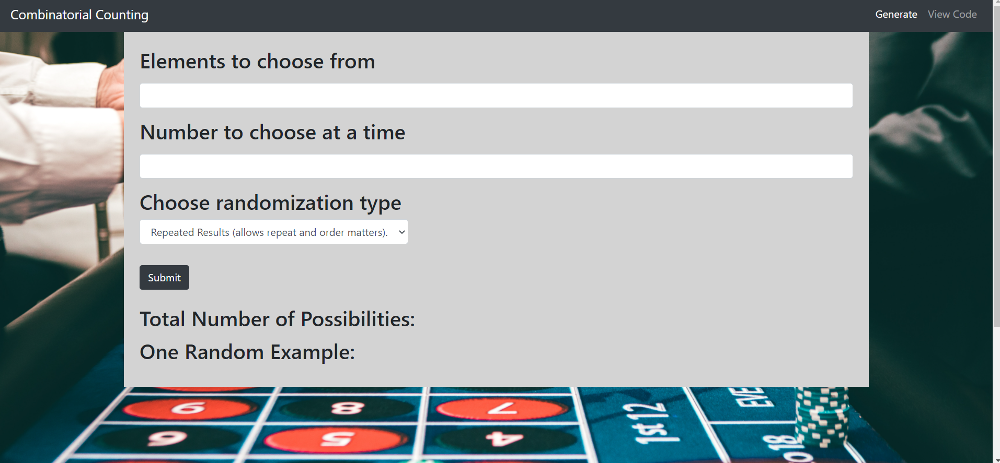

# Combinatorial Counting 
## Table of Contents 
 * [About](#About) 
 * [Usage](#Usage) 
 * [Contact](#Contact) 
 * [License](#License) 
  
## About 
 In this project the user is able to calculate and get an example of repeated experiments, permutations, combinations and multisets.  By typing in the number of elements to choose from, the number of elements they want to pick at a time and the type of counting they want to do, the total number of ways this can be done is displayed along with a random example satisfying the conditions.
  
 
## Usage 
 In order to this project as a user, you will go to the [deployed project](https://jalbert12485.github.io/permutations/).  When there, there will be a from where you can input the number of elements you have to choose from, the number of items you want to pick at a time, and whether or not repetition is allowed or order matters.  A random example and the total number of such is examples is then display.

 If you would like to use this repo as developer to create your own portfolio.  Feel free to do so, provided you supply your own information to the portfolio.  You can clone this repository at [GitHub](https://github.com/jalbert12485/permutations.git) 
```sh 
git clone https://github.com/jalbert12485/permutations.git
 ```    

Of particular use to developers will be the code of the functions themselves.  While there are frameworks that provide this functionality, there are not vanilla javaScript commands for these commonly used functions.  In particular, probability makes wide use combinations and permutations, so having a function available to you to calculate these can be very helpful.  In the code, I have constructed these functions as well as the function for counting repeated results and multisets using vanilla javaScript.  Furthermore, while generating a single number or mulitple numbers is trivial, creating an array without repition or placed in ascending order is not.  Here again the code for such a random permutation or combination is provided.  If you would prefer not to clone the github repo, you can simply view the javaScript file by clicking the view code link in the navbar.

## Contact 
 If you would like more information please contact me at [email](mailto:jalbert@carthage.edu).  Any additional information you would like to give me in your email will be greatly appreciated.
## License 
 This is free and unencumbered software released into the public domain. Anyone is free to copy, modify, publish, use, compile, sell, or distribute this software, either in source code form or as a compiled binary, for any purpose, commercial or non-commercial, and by any means. 
 
 In jurisdictions that recognize copyright laws, the author or authors of this software dedicate any and all copyright interest in the software to the public domain. We make this dedication for the benefit of the public at large and to the detriment of our heirs and successors. We intend this dedication to be an overt act of relinquishment in perpetuity of all present and future rights to this software under copyright law. 
 
 THE SOFTWARE IS PROVIDED 'AS IS', WITHOUT WARRANTY OF ANY KIND, EXPRESS OR IMPLIED, INCLUDING BUT NOT LIMITED TO THE WARRANTIES OF MERCHANTABILITY, FITNESS FOR A PARTICULAR PURPOSE AND NONINFRINGEMENT. IN NO EVENT SHALL THE AUTHORS BE LIABLE FOR ANY CLAIM, DAMAGES OR OTHER LIABILITY, WHETHER IN AN ACTION OF CONTRACT, TORT OR OTHERWISE, ARISING FROM, OUT OF OR IN CONNECTION WITH THE SOFTWARE OR THE USE OR OTHER DEALINGS IN THE SOFTWARE. 
 
 For more information, please refer to <https://unlicense.org> 
